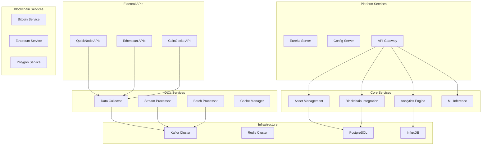

# 🚀 DEFIMON Java 8 Microservices Platform

**Enterprise-grade DeFi Analytics Platform built with Java 8 and Spring Boot**

DEFIMON is a comprehensive cryptocurrency analytics platform that provides real-time data collection, analysis, and machine learning predictions for DeFi assets across multiple blockchains.

## 🏗️ Architecture Overview

DEFIMON is built as a Java 8-centric microservices platform with the following architecture:



## 🎯 Key Features

### **Java 8 Enterprise Features**
- **High Performance**: ForkJoinPool + CompletableFuture for true parallelism
- **Resilience**: Circuit breakers, retry mechanisms, and graceful degradation
- **Monitoring**: Micrometer + Prometheus + Grafana for production observability
- **Caching**: Multi-level caching with Hazelcast + Redis
- **Security**: Spring Security + JWT authentication
- **Configuration**: Dynamic configuration with Spring Cloud Config

### **Blockchain Integration**
- **Multi-Chain Support**: Bitcoin, Ethereum, Polygon, and 50+ other blockchains
- **QuickNode Integration**: High-performance blockchain data access
- **Real-time Processing**: Kafka Streams for real-time analytics
- **Smart Contract Analysis**: Web3j integration for Ethereum/Polygon

### **Data Analytics**
- **Real-time Metrics**: On-chain, financial, and social metrics
- **ML Predictions**: Investment scoring and risk assessment
- **Historical Analysis**: Time-series data with InfluxDB
- **Stream Processing**: Real-time event processing with Kafka Streams

## 🚀 Quick Start

### Prerequisites

- **Java 8** (JDK 8 or higher)
- **Maven 3.6+**
- **Docker & Docker Compose**
- **Git**

### 1. Clone and Build

```bash
# Clone the repository
git clone <repository-url>
cd defimon-java8

# Build all services
./deployment/scripts/build-all.sh
```

### 2. Deploy Development Environment

```bash
# Deploy to development
./deployment/scripts/deploy-dev.sh
```

### 3. Access Services

- **API Gateway**: http://localhost:8080
- **Eureka Dashboard**: http://localhost:8761
- **Grafana**: http://localhost:3000 (admin/admin)
- **Prometheus**: http://localhost:9090
- **Jaeger**: http://localhost:16686

## 📁 Project Structure

```
defimon-java8/
├── platform-services/          # Core Platform
│   ├── eureka-server/          # Service Discovery
│   ├── config-server/          # Configuration Management
│   ├── admin-server/           # Spring Boot Admin
│   └── api-gateway/            # API Gateway
├── core-services/              # Business Logic
│   ├── asset-management-service/
│   ├── blockchain-integration-service/
│   ├── analytics-engine-service/
│   └── ml-inference-service/
├── data-services/              # Data Processing
│   ├── data-collector-service/
│   ├── stream-processing-service/
│   ├── batch-processing-service/
│   └── cache-management-service/
├── blockchain-services/        # Blockchain-Specific
│   ├── bitcoin-service/
│   ├── ethereum-service/
│   ├── polygon-service/
│   └── multichain-service/
├── shared-libraries/           # Common Components
│   ├── defimon-common/
│   ├── defimon-security/
│   ├── defimon-monitoring/
│   └── defimon-blockchain/
├── python-services/           # Limited Python Usage
│   ├── ml-training-service/
│   └── data-science-service/
├── infrastructure/            # Infrastructure as Code
├── deployment/               # Deployment Scripts
└── k8s/                     # Kubernetes Configs
```

## 🔧 Configuration

### Environment Variables

Key configuration variables for the platform:

```bash
# QuickNode Bitcoin API (from bitcoin.conf)
BITCOIN_QUICKNODE_RPC_URL=https://orbital-twilight-mansion.btc.quiknode.pro/a1280f4e959966b62d579978248263e3975e3b4d/
BITCOIN_QUICKNODE_RPC_USER=bitcoin
BITCOIN_QUICKNODE_RPC_PASSWORD=ultrafast_archive_node_2024

# Database
SPRING_DATASOURCE_URL=jdbc:postgresql://postgresql:5432/defimon_db
SPRING_REDIS_HOST=redis

# Kafka
SPRING_KAFKA_BOOTSTRAP_SERVERS=kafka:29092

# Service Discovery
EUREKA_CLIENT_SERVICE_URL_DEFAULTZONE=http://eureka-server:8761/eureka
```

### Application Profiles

- **dev**: Development environment with debug logging
- **docker**: Docker environment with container networking
- **prod**: Production environment with optimized settings

## 🏃‍♂️ Running Services

### Individual Service Development

```bash
# Run a specific service
cd platform-services/eureka-server
mvn spring-boot:run

# Run with specific profile
mvn spring-boot:run -Dspring-boot.run.profiles=dev
```

### Docker Compose

```bash
# Start all services
docker-compose up -d

# Start specific services
docker-compose up -d eureka-server config-server api-gateway

# View logs
docker-compose logs -f data-collector

# Scale services
docker-compose up -d --scale data-collector=3
```

## 📊 Monitoring & Observability

### Metrics
- **Prometheus**: Metrics collection and storage
- **Grafana**: Dashboards and visualization
- **Micrometer**: Application metrics

### Tracing
- **Jaeger**: Distributed tracing
- **Zipkin**: Alternative tracing backend

### Logging
- **Structured Logging**: JSON format with correlation IDs
- **Log Aggregation**: ELK Stack integration ready

### Health Checks
- **Spring Boot Actuator**: Health endpoints for all services
- **Custom Health Indicators**: Database, Kafka, Redis connectivity

## 🔒 Security

### Authentication & Authorization
- **JWT Tokens**: Stateless authentication
- **Spring Security**: Role-based access control
- **API Key Management**: Secure API access

### Network Security
- **TLS/SSL**: Encrypted communication
- **Rate Limiting**: API protection
- **CORS Configuration**: Cross-origin request handling

## 🚀 Production Deployment

### Docker Swarm

```bash
# Initialize swarm
docker swarm init

# Deploy stack
docker stack deploy -c docker-compose.prod.yml defimon
```

### Kubernetes

```bash
# Apply configurations
kubectl apply -f k8s/namespace.yaml
kubectl apply -f k8s/configmaps/
kubectl apply -f k8s/secrets/
kubectl apply -f k8s/deployments/
```

### Cloud Deployment

- **AWS EKS**: Elastic Kubernetes Service
- **Google GKE**: Google Kubernetes Engine
- **Azure AKS**: Azure Kubernetes Service

## 🧪 Testing

### Unit Tests
```bash
# Run all tests
mvn test

# Run specific service tests
cd data-services/data-collector-service
mvn test
```

### Integration Tests
```bash
# Run with TestContainers
mvn verify -P integration-tests
```

### Load Testing
```bash
# Use Apache JMeter or similar tools
# Test API endpoints through the gateway
```

## 📈 Performance Tuning

### JVM Optimization
```bash
# Production JVM settings
JVM_OPTS="-Xms2g -Xmx4g -XX:+UseG1GC -XX:MaxGCPauseMillis=200"
```

### Database Optimization
- **Connection Pooling**: HikariCP with optimized settings
- **Query Optimization**: Indexed queries and prepared statements
- **Read Replicas**: Separate read/write databases

### Caching Strategy
- **L1 Cache**: Local Caffeine cache
- **L2 Cache**: Redis distributed cache
- **L3 Cache**: Database query result cache

## 🔄 CI/CD Pipeline

### GitHub Actions
```yaml
# Build and test on every commit
# Deploy to staging on merge to develop
# Deploy to production on merge to main
```

### Jenkins Pipeline
```groovy
// Multi-stage pipeline
// 1. Build and test
// 2. Security scanning
// 3. Deploy to environments
```

## 🤝 Contributing

### Development Workflow
1. Fork the repository
2. Create a feature branch
3. Make changes with tests
4. Submit a pull request

### Code Standards
- **Java 8**: Use Java 8 features and best practices
- **Spring Boot**: Follow Spring Boot conventions
- **Testing**: Maintain high test coverage
- **Documentation**: Update documentation for changes

## 📚 API Documentation

### Swagger/OpenAPI
- **API Gateway**: http://localhost:8080/swagger-ui.html
- **Individual Services**: Each service exposes its own API docs

### Postman Collection
- Import the provided Postman collection for API testing
- Environment variables for different deployment stages

## 🆘 Troubleshooting

### Common Issues

#### Service Discovery Issues
```bash
# Check Eureka registration
curl http://localhost:8761/eureka/apps

# Restart service discovery
docker-compose restart eureka-server config-server
```

#### Database Connection Issues
```bash
# Check PostgreSQL connectivity
docker-compose exec postgresql pg_isready -U defimon

# View database logs
docker-compose logs postgresql
```

#### Kafka Issues
```bash
# Check Kafka topics
docker-compose exec kafka kafka-topics --bootstrap-server localhost:9092 --list

# View Kafka logs
docker-compose logs kafka
```

### Log Analysis
```bash
# View service logs
docker-compose logs -f [service-name]

# Search for errors
docker-compose logs [service-name] | grep ERROR

# Follow logs in real-time
docker-compose logs -f --tail=100 [service-name]
```

## 📞 Support

### Documentation
- **Architecture Guide**: Detailed system architecture
- **API Reference**: Complete API documentation
- **Deployment Guide**: Production deployment instructions

### Community
- **GitHub Issues**: Bug reports and feature requests
- **Discord**: Community discussions
- **Stack Overflow**: Tag questions with `defimon`

## 📄 License

This project is licensed under the MIT License - see the [LICENSE](LICENSE) file for details.

## 🙏 Acknowledgments

- **Spring Boot**: Enterprise Java framework
- **Spring Cloud**: Microservices toolkit
- **QuickNode**: Blockchain infrastructure
- **BitcoinJ**: Bitcoin Java library
- **Web3j**: Ethereum Java library

---

**Built with ❤️ using Java 8 and Spring Boot for enterprise-grade DeFi analytics**
